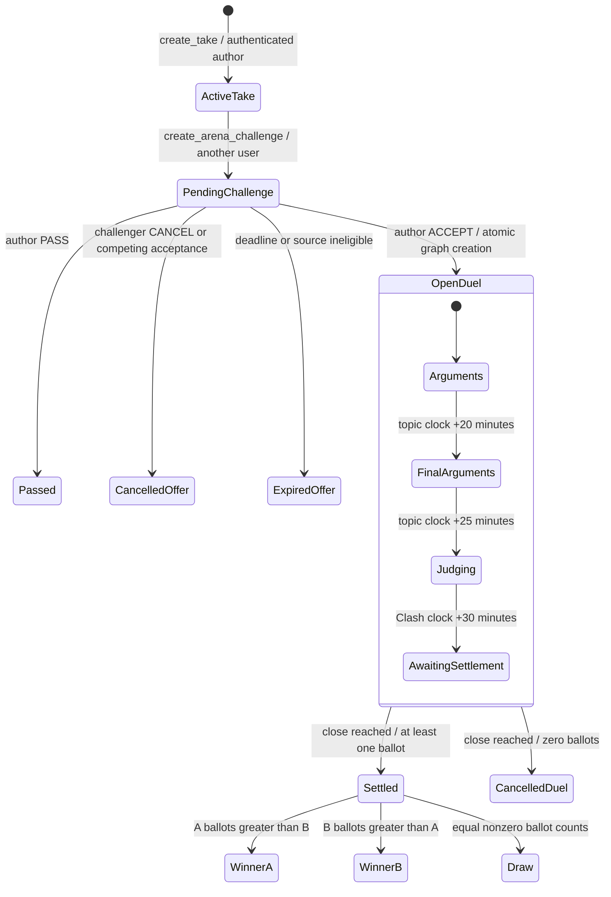

# Canonical Clash lifecycle audit — Phase 3, Step 1

Audited 2026-10-08 against `main`, HEAD `b362584b956b038030899bea5d429224ff3e55b9`.
Audit only: no lifecycle implementation, migration, UI change, judging-rule change,
database reset, hosted migration, or legitimate-record mutation was performed.
This document is the only new tracked-scope deliverable. Existing dirty Crew work
and development scripts were preserved. No commit or push was requested for this audit.

## Actual lifecycle

The nested stages describe server-clock phases, not extra `clashes.status` values.
An offer cancellation does not cancel an accepted competition. No pause, resume,
disconnect forfeiture, per-turn expiry, or automatic fighter winner exists.

1. `create_take` derives the author from the authenticated profile. Text is at most
   180 characters; attached media must be owned, ready and public. Table defaults
   establish the 24-hour Take window. The Take is the source proposition.
2. `create_arena_challenge` derives challenger and original Take author, validates
   a 20–500 character counter-position, bilateral safety, active source and more
   than 30 minutes remaining. Offers last at most two hours, capped at Take expiry
   minus the duel window. New offers are throttled at ten/hour. Take locking and
   the partial pending-pair index deduplicate a repeated pending offer.
3. Only the recipient accepts/passes; only the sender cancels. Acceptance acquires
   request advisory lock, Take, Challenge, then canonical Clash/Room locks. It
   calls private `create_arena_duel` using the Challenge UUID as the stable key.
4. One transaction creates the STANDARD Clash, dedicated existing topic clock,
   linked Room, two debaters, accepted link, competing-offer cancellations and
   acceptance notification. A failure rolls back the graph and quota charges.
   Matching retries return existing IDs. Conflicting terminal actions fail or
   return an already cancelled/expired offer without creating a duel.
5. Fighter A is `takes.author_id`; B is `clashes.challenger_id`. Their identity and
   the canonical Room link are immutable. Capacity and debater count are exactly
   two; other members are spectators. Accepted source ownership is frozen.
6. Acceptance opens immediately. The dedicated clock provides 20 minutes of
   arguments, five minutes of final arguments, then five minutes of judging.
7. Official contributions are existing Room messages/evidence. Replies use
   `parent_message_id`; they are not a separate rebuttal round. Either fighter
   can publish repeatedly during the shared argument window, subject to rate
   limits. There is no alternating-turn protocol, individual deadline or minimum
   participation requirement. The accepted counter-position is exposed separately
   in the Clash payload; it is not manufactured into an official message.
8. `submit_judgement` records one A/B ballot per profile. Duel guards allow it
   only between `judging_at` and `closes_at`, prohibit fighters and check hidden
   relationships. The first ballot stands; a different-side retry is a no-op.
9. `settle_clash` locks Clash before Room and delegates to the private existing
   tally. At close, zero ballots cancel both entities without a verdict. One or
   more ballots settle A/B/DRAW. Settlement does not require either fighter to
   have posted. This is the current rule, not an invented forfeiture.
10. Verdict, ledger writes, profile updates, notifications and terminal Room state
    commit atomically. A settled retry returns the verdict before awarding again.
    A canonical cancelled retry returns cancelled without a new award. Historical
    Stage reads remain membership/visibility scoped. Settled Crowd is read-only;
    cancelled Crowd is denied, even to existing members.

## Ownership and operation map

| Domain | Authoritative tables | Operations / owner |
| --- | --- | --- |
| Proposition | `takes`, `media_objects` | `create_take`; authenticated identity, server defaults/media checks |
| Offer | `arena_challenges` | `create_arena_challenge`, `resolve_arena_challenge`, party-scoped list RPCs; no client DML |
| Competition | `clashes` | `create_arena_duel` service/owner only, invoked inside acceptance; legacy `start_clash` remains independent |
| Execution clock | `arena_daily_topics` | Creation sets opens/final/judging/closes; maintenance transitions topic publication |
| Execution surface | `arena_rooms`, `arena_room_participants` | Unique `clash_id`; two fighters; `watch_arena_room` adds spectators |
| Official transcript | `arena_room_messages`, `arena_room_evidence` | Existing publishing/evidence/reshare RPCs; actor derived server-side; canonical insert guards |
| Official outcome | `judgements`, `verdicts` | `submit_judgement`, `settle_clash`; one ballot per juror and one verdict per Clash |
| Economy | `reputation_events`, `profiles` | Private settlement applies ledger/profile changes in its transaction |
| Notifications | `notifications` | Challenge deterministic IDs; Clash notifications emitted within once-only settlement transaction |
| Audience | `arena_crowd_messages` | Separate Crowd context/page/hydration/post/report/moderation RPCs; cannot enter official transcript |
| Typing | `arena_room_typing`, `realtime.messages` | Caller-derived fighter RPC writes expiring state; authorized private broadcast hints only |
| Recovery | `cron.job`, maintenance RPCs | `clash-maintenance` calls `run_maintenance(500)` every minute; API queue sweeps are service/owner only |

`arena_rooms.clash_id IS NULL` retains legacy GROUP semantics. Linked DUEL Rooms
cannot write group side ballots, argument ballots or `arena_room_results`; their
settlement never delegates to group rewards. Old Clashes are not backfilled.

## Timing, recovery and integrity invariants

- PostgreSQL controls all write windows. Creation uses transaction `now()`;
  argument/judgement guards and Crowd sending additionally use `clock_timestamp()`.
  Reads and maintenance generally use transaction time. Client timers only affect
  presentation; they cannot authorize a server write. Creation's clock is captured
  before lock waits, so a delayed transaction can shorten the post-commit window;
  there is no promised 30 minutes measured from client receipt.
- Clash states are `open`, `settled`, `cancelled`; topic states are `scheduled`,
  `live`, `closed`; stored Room states are `OPEN`, `FINAL_ARGUMENTS`, `JUDGING`,
  `SETTLED`, `CANCELLED`. `scheduled` and `closed` are also derived Room phases.
  Newly accepted duels are immediate, not scheduled. `EXPIRED` belongs to offers/
  Takes; paused is not represented. Upcoming discovery can describe future-clock
  records but acceptance currently has no scheduling feature.
- Deferred integrity triggers require the complete graph, equal opening/closing
  clocks, canonical participants and matching terminal Clash/Room state. Settled
  duels require a verdict; nonsettled duels cannot own one. Stored intermediate
  Room phases may lag the clock; payloads derive phase/status and insert guards
  enforce the true deadline. Terminal divergence cannot commit normally.
- Local installed `run_maintenance` settles due Clashes first, expires Takes and
  runs other existing maintenance, then transitions Arena Rooms. Both batch loops
  isolate individual failures with `exception when others ... null`. This permits
  retries but hides failed-item reasons; a successful cron run is not proof that
  every due item succeeded. There is no recovery alert/dead-letter record.
- Disconnecting neither changes fighter membership nor pauses the clock. Typing
  expires after six seconds. Abandoned duels reach the normal close path if
  maintenance runs: zero ballots mean cancellation, ballots mean existing tally.
  No automatic forfeiture/winner is implemented. Cancelled outcomes lack a stored
  reason and terminal timestamp comparable to settled `settled_at`.
- Acceptance and Crowd posts have stable server idempotency. Ballots use a unique
  `(clash_id,juror_id)` key. Settlement serializes on the competition row. Official
  message/evidence requests do **not** have client request keys: an ambiguous lost
  response followed by a retry can create another official contribution.
- Publishing and settlement synchronize on the Clash lock, and duel judgement
  guards recheck wall time after locking. Existing concurrency tests exercise
  creation retries and ballot versus settlement. They do not exercise all official
  publish/evidence versus settlement interleavings or cross-Clash reward contention.

## Stage, Crowd and account isolation

Canonical participant/content triggers prevent a spectator becoming Fighter C or
posting as A/B. Actor identities are derived in publishing RPCs; direct client
INSERT/UPDATE/DELETE grants are denied. Trusted system notices and moderation
updates remain possible. These are server protections, not transcript filtering
alone. Messages/evidence are membership-only and hidden/blocked/muted/source
visibility is enforced on existing read paths.

Crowd uses its own table, RLS and publication. Membership and canonical identity
are required; raw event text is never rendered. Author-scoped UUID retries,
5/minute and 30/10-minute quotas, server deadline rechecks, reporting and Hood
moderation apply. Settled members may read history but cannot send new messages.
Cancellation disables both Crowd reads and the UI subscription. Spectator counts
are persisted joined memberships, **not** concurrent online viewers.

Private typing uses `private: true` broadcasts containing invalidation hints;
server RPC hydration supplies identity/reply metadata. No client Presence or
broadcast INSERT policy permits spoofing; outsider private metadata reads are
denied. Typing polls every three seconds and has server expiry. AccountScope keys
the entire store/screen tree by Auth ID; the Room screen also keys its scope by
Room ID. Late responses target disposed scopes. Crowd adds generation/identity
guards; challenge resolution checks the account before and after requests.

Stage performs ID hydration, 30-second phase/visibility reconciliation and
foreground refresh. Crowd performs precise `(timestamp,UUID)` gap pagination,
15-second active reconciliation, deduplication and bounded history. These reduce
missed-event and safety-cache drift; they do not claim immediate revocation of
already displayed content or durable offline delivery. Stage subscriptions lack
the Crowd connection-state callback; Stage recovers through polling/foreground.

## Judging and outcomes: actual model

Current judging is public authenticated A/B voting, not an assigned independent
jury. Fighters are excluded; anonymous callers are excluded. No Crew-affiliation,
independence, conflict-of-interest, reviewer qualification, transcript-consumption,
quorum-above-one or anti-collusion rule is enforced. Room membership is not required
by the current ballot RPC. This is a later judging-design decision, distinct from
the confirmed removed-source authorization defect below.

Majority count decides A/B; a nonzero tie is DRAW. Zero votes cancel without a
verdict, reward or result notification. A single ballot suffices. Verdict labels
use margin: DRAW, SPLIT DECISION (at most one), CLEAR DECISION (at most three), then
LANDSLIDE. These are backend labels, not confidence from an independent jury.

Existing economy rewards **jurors**, not fighter wins/careers: winning-side jurors
receive +120 reputation/+40 coins and increment streak; dissent receives +25/+18
and resets streak; draw participation receives +15/+0 with no streak change.
Rank is recalculated by the existing helper. Fighters receive result notifications
but no canonical fighter-career award. Jury reward notifications and two fighter
result notifications are inside the settlement transaction. Their random IDs do
not provide a separate deduplication key; exactly-once behavior relies on the
locked terminal-state early return and atomic transaction. Challenge notifications
use deterministic IDs. No notification for decline/cancel/expiry is implemented.

The Stage renders the canonical verdict and keeps Back A/B local social support
separate. It does not use group Room results or Crowd reactions as judging. The
existing wording “made the stronger case” reports the vote winner; it does not
establish independent evaluation. Legacy notification navigation resolves Clash
to Take, then the canonical redirect resolves the linked Room; legacy UI remains.

## Severity-ranked findings

Confirmed below means verified in source and installed function definitions,
not a newly performed exploit against legitimate records. No fake public duel
was created to reproduce these gaps. Passing existing tests does not cover them.

| ID / severity | Finding and evidence | Minimal proposed correction |
| --- | --- | --- |
| L1 — High, authorization defect | Installed `submit_judgement` and `guard_arena_duel_judgement` check identity/time/relationships but never `arena_take_readable` or `arena_room_readable`. A known-ID request can vote on an open duel whose source was removed, despite reads being denied. | Gate canonical ballots using the same caller-scoped readable-source/Room predicate, under existing lock, and test removed-source/direct RPC denial. Do not add future independent-jury rules. |
| L2 — High, write/read inconsistency | `post_arena_room_message` and canonical content guard authorize fighter/time but do not enforce source readability or newly introduced fighter relationships. A previously assigned fighter can submit new official text after source removal or a new block; relevant reads deny it. | Recheck canonical readability/safety on official insert paths under Clash serialization, preserving trusted moderation and GROUP behavior. Review evidence/reshare paths together. |
| L3 — Medium, membership authorization gap | Installed `watch_arena_room` validates publication/status but never `arena_room_readable`. It can add membership or return Room metadata by known ID despite a removed/hidden canonical source. Protected transcript/Crowd hydration still denies inaccessible content. | Authorize canonical watch before membership/metadata writes, with late-state recheck and tests for removed sources and block/mute changes. |
| L4 — Medium, retry integrity gap | Official post/evidence APIs have no stable request key; optimistic rollback on response failure cannot distinguish a committed write. Retrying can duplicate an argument. | Add compatibility-safe optional request-key support for canonical official writes and retain it across failed client confirmation; test same-key contention/altered payload. |
| L5 — Medium, transcript recovery defect | Official list cursors use timestamp only; client converts PostgreSQL time to milliseconds. Older pages use strict `<`, and gap fetch selects newest-first at most 40 once. Equal-time rows can be skipped and a gap larger than recent/gap windows can remain missing until manual older paging. | Add an additive precise timestamp+ID cursor and drain reconnect gaps oldest-first, following Crowd's established pattern; test equal timestamps and over-40/over-80 gaps. |
| L6 — Medium, historical navigation mismatch | Backend permits a new spectator to watch a SETTLED Room. `DuelRoomExperience` offers Watch only while Clash is open and phase not closed; a new historical visitor remains locked without an entry action. Cancelled Rooms deliberately cannot be newly watched. | Offer historical entry for readable settled Rooms using the existing RPC; preserve cancelled-member-only Stage and cancelled Crowd denial. |
| L7 — Medium, recovery observability gap | Settlement/transition batch errors are silently swallowed. A broken duel can remain open past close with no item error even while cron reports success. Canonical Room UI has no direct settlement retry; legacy route fallback is skipped intentionally. | Add bounded server failure diagnostics and a truthful recoverable pending-settlement state; decide whether an authorized canonical single-Clash fallback is needed. Never reopen/award by client clock. |
| L8 — Low, cancellation contract mismatch | `settleClash` service accepts only verdict-shaped responses, while the valid zero-vote server result is `{status: cancelled,jury_size:0}`. It reports `bad_payload` after a successful cancellation. Current canonical UI does not call this service for settlement. | Parse a discriminated settlement result and preserve legacy callers; regression-test cancelled retries. |

Missing features / policy decisions, **not fixes to invent now**: alternating turns,
fighter readiness, pause/resume, forfeiture, per-turn deadlines, scheduled acceptance,
minimum official participation, independent judging/Crew conflict checks, stronger
quorum, fighter career awards, user cancellation after acceptance, cancellation
reason/timestamps, complete notification lifecycle and durable offline queues.
The backend can settle a one-ballot duel with no official posts; changing this
requires an approved eligibility/outcome policy, not a fabricated automatic winner.

## Validation actually executed

All commands below completed with exit code 0 on this checkout. No new tests or
fixtures were added. Existing SQL tests run in rollback transactions; existing
dblink concurrency tests create and clean their own committed test fixtures.
Outside those tests, local database inspection was SELECT-only.

| Check | Actual result |
| --- | --- |
| `npm run typecheck` | Passed |
| `npm run test:unit` | 418 passed, 112 suites, zero failed/skipped |
| `npm run test:duel:render` | 19/19; native modules bridged, not physical verification |
| `npm run test:crowd:service` | 7 service/subscription checks passed |
| `npm run test:challenge-inbox` | 18/18 client/component checks passed |
| `node scripts/account-isolation-check.cjs` | Both scope replacement and stale/disposed auth checks passed |
| `node scripts/typing-service-check.cjs` | Private subscription, genuine server identity, forged-hint rejection and disposal checks passed |
| `npx expo-doctor` | 18/18 passed |
| Complete existing workspace database suite | 70 SQL files, 2,620 assertions passed; zero failures |

Database tests used the existing ignored `.expo/android-startup-check/interest-db-suite.cjs`
runner and explicit localhost:55322 `supabase_admin` connection. It sets pgTAP
search_path and translates four existing psql `gset` directives. This is **not** a
claim that `supabase test db` ran/passed. The responsive direct database path was
used; Docker/CLI diagnosis from earlier reports was not repeated. No reset or
clean migration replay was undertaken. The full suite includes pre-existing
uncommitted Crew test 052; a clean tracked-only environment was not rerun.

Relevant suite results: engine 002 (59), draw 008 (49), scheduler 010 (30), Phase 0
053 (35), canonical foundation 054 (78), canonical concurrency 055 (17), challenge
056 (82), challenge concurrency 057 (36), Crowd 058 (61), Crowd concurrency 059
(13), profile security 060 (17), relationships/Crew 061 (23), visibility 062 (20),
private typing 063 (15), discovery 064 (15), inbox 069 (39): all passed.
Coverage includes settlement/reputation/notification idempotency, acceptance versus
cancellation, official impersonation denial, group outcome exclusion, Crowd
quota/cancellation races, and private Presence spoofing/access denial.

Read-only installed checks: one active `clash-maintenance` job, every minute,
`select public.run_maintenance(500)`; last three job runs succeeded. There is one
retained canonical graph, CANCELLED/cancelled, no invalid terminal pairing and no
overdue open canonical duel. The known concurrency fixture Takes were absent
after testing. Installed definitions and ACLs were inspected for mutation/read/
maintenance seams; security migrations' internal helper substitutions are present.
No hosted connection or migration command was used. No physical Android journey
or new two-session live WebSocket test was performed in this audit; earlier device
reports are historical evidence only, not this checkpoint's result.

## Recommended Phase 3 Step 2 scope

After approval, address L1–L3 first as one narrowly scoped authorization group,
with adversarial direct RPC and removed-source/block transition tests. Then address
L4/L5 as retry/recovery contracts without rewriting the transcript engine. Address
L6/L8 with minimal navigation/result-contract corrections. Add L7 diagnostics and
failure/retry tests without altering outcome rules. Validate canonical and GROUP
compatibility, concurrency, account switching, settled/cancelled histories and
physical Android against legitimate available records. Any unavailable live state
must be reported, not manufactured as ordinary public activity.

Preserve Supabase/PostgreSQL authority, existing constraints, profile projections,
private typing authorization, hidden-content/fixture exclusions, account scopes,
neutral group Pulse, server-only economy and legacy routes. Keep all uncommitted
Crew files/scripts untouched. Do not include new judging mechanics, Corners,
Assists, streaming, paid features, AI clones, new Mindshift, Community Clashes,
career/season/tournament systems, unrelated onboarding, Vault or World work.

## Exact source files inspected

Content was read in full or in focused relevant sections; inventory-only search
hits are not represented as fully audited files. Installed SQL definitions listed
above were also inspected directly, since later migrations patch earlier bodies.

**Database migrations:**

- `supabase/migrations/20260926120000_initial_arena_schema.sql`
- `supabase/migrations/20260926160000_clash_engine.sql`
- `supabase/migrations/20260927010000_clash_draw.sql`
- `supabase/migrations/20260927030000_clash_scheduler.sql`
- `supabase/migrations/20261002150000_live_arena_enums.sql`
- `supabase/migrations/20261002150100_live_arena_schema.sql`
- `supabase/migrations/20261006150000_arena_correctness_foundation.sql`
- `supabase/migrations/20261007120000_arena_duel_foundation.sql`
- `supabase/migrations/20261007130100_arena_challenge_lifecycle.sql`
- `supabase/migrations/20261008100100_arena_crowd_chat.sql`
- `supabase/migrations/20261008110100_relationship_and_crew_security.sql`
- `supabase/migrations/20261008110200_arena_content_visibility.sql`
- `supabase/migrations/20261008110300_private_room_typing.sql`
- `supabase/migrations/20261008110500_private_viewer_helpers.sql`
- `supabase/migrations/20261008110600_canonical_topic_visibility.sql`
- `supabase/migrations/20261008121000_arena_discovery_states.sql`
- `supabase/migrations/20261008151000_arena_challenge_inbox.sql`

**Application:**

- `package.json`
- `services/apiService.ts`
- `services/clashEngineService.ts`
- `services/liveArenaService.ts`
- `services/arenaChallengeService.ts`
- `services/arenaCrowdService.ts`
- `hooks/useLiveArenaRoom.ts`
- `hooks/useArenaCrowd.ts`
- `hooks/useRoomTyping.ts`
- `store/AccountScope.tsx`
- `store/AuthProvider.tsx`
- `app/arena/room/[roomId].tsx`
- `app/clash/[takeId].tsx`
- `app/(tabs)/notifications.tsx`
- `components/arena/TakeChallenges.tsx`
- `components/liveArena/DuelRoomExperience.tsx`
- `components/liveArena/DuelRoomOutcome.tsx`
- `utils/arenaDuelPayload.ts`
- `utils/duelPresentation.ts`

**Test source inspected:**

- `supabase/tests/002_clash_engine.sql`
- `supabase/tests/008_clash_draw.sql`
- `supabase/tests/010_clash_scheduler.sql`
- `supabase/tests/054_arena_duel_foundation.sql`
- `supabase/tests/055_arena_duel_concurrency.sql`
- `supabase/tests/056_arena_challenge_lifecycle.sql`
- `supabase/tests/057_arena_challenge_concurrency.sql`
- `supabase/tests/058_arena_crowd_chat.sql`
- `supabase/tests/059_arena_crowd_concurrency.sql`
- `supabase/tests/063_private_room_typing.sql`
- `scripts/account-isolation-check.cjs`
- `scripts/typing-service-check.cjs`

**Documentation:**

- `supabase/ARENA_DUELS.md`
- `supabase/ARENA_CHALLENGES.md`
- `supabase/ARENA_WATCHABILITY.md`
- `supabase/ARENA_CROWD.md`
- `supabase/SECURITY_REMEDIATION.md`
- `supabase/ARENA_RECORDING_DIAGNOSIS.md`

The complete 70-file database execution and additional client/render checks are
execution coverage, not a claim of line-by-line inspection of every test source.
Ignored verification logs are under `.expo/android-startup-check/lifecycle-audit-*.log`.
Findings are scoped to the inspected lifecycle, not a zero-vulnerability or
production-readiness certification. Stop here pending approval.
